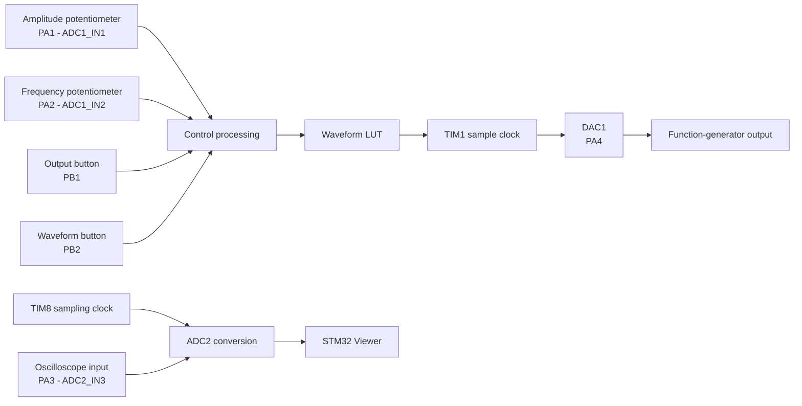
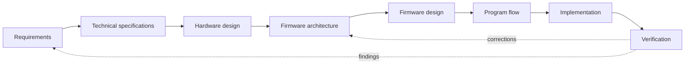
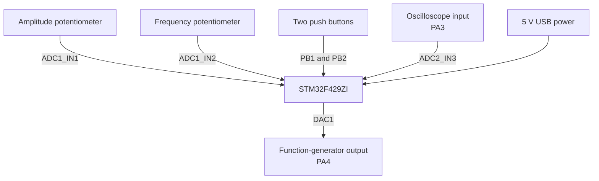
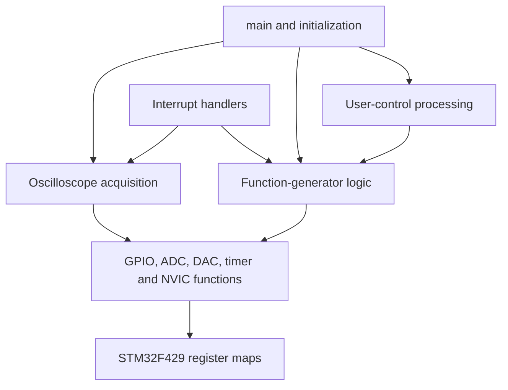
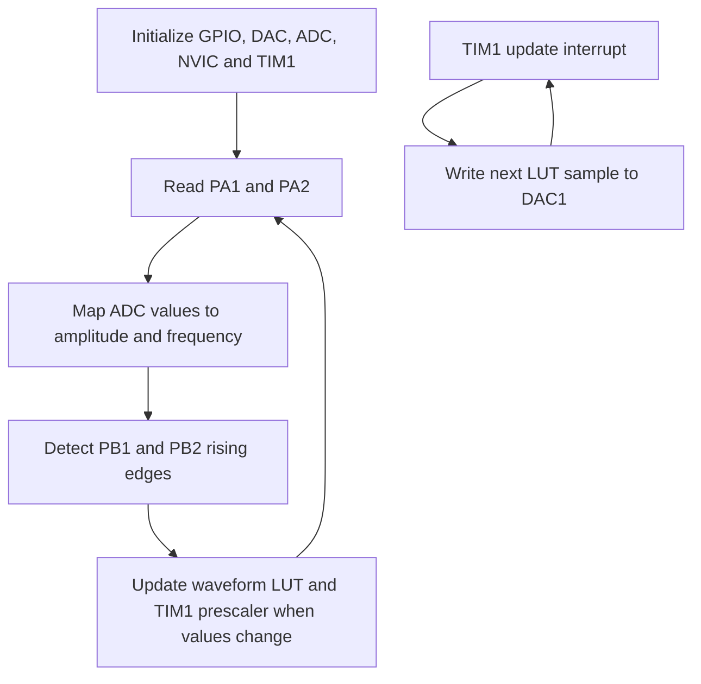
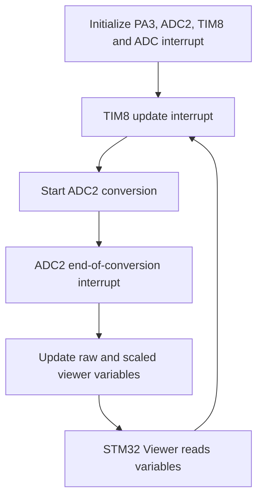

# EduScope-10

**Low-cost 2-in-1 bare-metal STM32 oscilloscope and function generator**

> Mission: make practical measurement tools affordable enough that engineering students can learn by measuring, not guessing

**Current status:** fully functional bare-metal prototype completed on STM32F429I-DISC1  
**Next milestone:** custom Rev-A PCB

---

## 1. Story and purpose

EduScope-10 started from a problem I experienced while studying Electronics Engineering in Sudan: many laboratories did not have enough basic measurement instruments for every student to experiment independently

The project addresses that problem with a simple product concept:

- one oscilloscope input
- one function-generator output
- direct ownership instead of shared laboratory access
- a future core PCB BOM target of approximately **USD 10 at 1k volume**
- a modular path toward a protected front end, enclosure, local display, USB control, and improved performance

The USD 10 target refers to the future core PCB BOM at volume. It excludes probes, external connectors, USB cable, enclosure, shipping, and optional expansion modules

---

## 2. Current prototype status

The current development milestone is a working proof of concept on the **STM32F429I-DISC1** development board

| Area | Status |
|---|---|
| Bare-metal register access | Implemented |
| Function generator | Implemented and validated |
| Sine, square, triangle, sawtooth | Implemented |
| Real-time frequency control | Implemented using a potentiometer |
| Real-time amplitude control | Implemented using a potentiometer |
| Waveform selection | Implemented using a push button |
| Output enable/disable | Implemented using a push button |
| Oscilloscope ADC acquisition | Implemented using ADC2 and TIM8 |
| Live signal visualization | Implemented using STM32 Viewer |
| Protected analog front end | Planned for Rev-A PCB |
| USB data and control | Planned |
| Custom PCB | Next development step |

The prototype demonstrates both instrument paths using direct STM32 register access without CubeMX-generated peripheral code or HAL-based application logic

---

## 3. Hardware prototype setup


<div align="center">
  <table>
    <tr>
      <td align="center" width="850" height="360">
        <strong>HARDWARE SETUP PHOTO</strong><br><br>
        
      </td>
    </tr>
  </table>
</div>

---

## 4. Prototype capabilities

### Function generator

- DAC channel 1 output on **PA4**
- 128-sample waveform lookup table
- TIM1 update interrupt as the waveform sample clock
- sine, square, triangle, and sawtooth waveforms
- amplitude control through **PA1 / ADC1 channel 1**
- frequency control through **PA2 / ADC1 channel 2**
- output enable/disable through **PB1**
- waveform selection through **PB2**
- current prototype frequency control range: approximately **0.1 Hz to 2.5 kHz**
- current prototype amplitude control: approximately **0 to 3.3 Vpp**, centered near 1.65 V

### Oscilloscope acquisition

- analog input on **PA3 / ADC2 channel 3**
- TIM8 establishes the sampling interval
- ADC2 performs one conversion per TIM8 update event
- ADC end-of-conversion interrupt updates live variables
- current configured sample rate: **5 kS/s**
- visualization through **STM32 Viewer**
- viewer variables:

```text
g_scope_adc_raw       uint16_t     raw ADC value, 0 to 4095
g_scope_voltage_v     float        prototype-calibrated voltage
```

> The PA3 input is currently a development-board ADC input, not a protected oscilloscope front end. Keep the input within the STM32 analog voltage range

---

## 5. System overview



---

## 6. Development workflow

The project follows the professional embedded-development sequence used in the Firmware Development Workflow Guide



The process is applied as a tight good-enough loop. Each stage is defined clearly enough to support the next stage, then test results are fed back into the requirements and design before technical debt accumulates

Current development path:

```text
Requirements defined
-> technical specification defined
-> development-board hardware mapped
-> bare-metal firmware implemented
-> function generator validated
-> ADC2 acquisition validated
-> custom PCB design in progress
```

---

## 7. Technical specification - current prototype

| Item | Prototype implementation |
|---|---|
| Development board | STM32F429I-DISC1 |
| MCU | STM32F429ZI, ARM Cortex-M4F |
| Firmware language | C |
| Development environment | VS Code + PlatformIO |
| Peripheral implementation | Direct register access |
| Generated peripheral code | None |
| Current clock assumption | 16 MHz |
| Function-generator output | DAC1 on PA4 |
| Function-generator timing | TIM1 update interrupt |
| Waveform table | 128 samples |
| Control ADC | ADC1 channels 1 and 2 |
| Oscilloscope ADC | ADC2 channel 3 |
| Oscilloscope timing | TIM8 update interrupt |
| Scope visualization | STM32 Viewer |
| Power | Development-board USB power |

---

## 8. Hardware design view

This diagram shows only the hardware relationships relevant to the firmware. Protection, filtering, biasing, decoupling, power, and PCB implementation belong to the custom-board schematic



### Prototype pin map

| Function | STM32 pin | Peripheral |
|---|---|---|
| Function-generator output | PA4 | DAC1_OUT1 |
| Amplitude potentiometer | PA1 | ADC1_IN1 |
| Frequency potentiometer | PA2 | ADC1_IN2 |
| Oscilloscope input | PA3 | ADC2_IN3 |
| Output enable button | PB1 | GPIO input with pull-down |
| Waveform selection button | PB2 | GPIO input with pull-down |

---

## 9. Firmware architecture

The firmware is intentionally kept in one C file for the current prototype. The file is still divided into clear internal sections so the register layer, drivers, instrument behavior, controls, and interrupt handlers remain easy to follow



### `main.c` organization

```text
1. Configuration constants
2. STM32 register maps
3. Register bit definitions
4. Application state
5. Peripheral initialization
6. Timer control
7. ADC control reading
8. Function-generator logic
9. Oscilloscope acquisition
10. User-control processing
11. Interrupt handlers
12. Main function
```

The code keeps the prototype simple while avoiding scattered register access and unused experimental sections

---

## 10. Program flow

### Function generator



### Oscilloscope



---

## 11. Repository structure

The repository is intentionally minimal

```text
EduScope-10/
├── main.c
├── platformio.ini
└── README.md
```

All firmware, register definitions, peripheral functions, application logic, and interrupt handlers are contained in `main.c`

---

## 12. Build and run

### Requirements

- STM32F429I-DISC1
- VS Code
- PlatformIO extension
- ST-LINK connection
- STM32 Viewer
- signal source for ADC testing
- oscilloscope or logic analyzer for function-generator validation

### Build

```bash
pio run
```

### Flash

```bash
pio run --target upload
```

### Prototype connections

1. Connect the amplitude potentiometer wiper to PA1
2. Connect the frequency potentiometer wiper to PA2
3. Connect the two buttons to PB1 and PB2 according to the pull-down design
4. Measure the generated waveform on PA4
5. Apply only a safe 0 to 3.3 V signal to PA3
6. Open STM32 Viewer and monitor `g_scope_adc_raw` or `g_scope_voltage_v`

The viewer is used for prototype visualization. Formal frequency, bandwidth, ENOB, and sample-rate measurements require captured buffers and calibrated bench equipment

---

## 13. Safety strategy

### Anchor standard

**IEC 61010-1** is the Rev-A safety design anchor because EduScope-10 is measurement equipment. It drives decisions concerning:

- declared measurement category and voltage limits
- SELV boundaries
- input protection
- insulation
- creepage and clearance
- single-fault behavior
- labeling and warnings
- abnormal-operation verification

### Current limitation

The development-board prototype is **not certified measurement equipment** and must not be connected to mains, CAT II, CAT III, CAT IV, or hazardous-energy circuits

The intended Rev-A baseline is **CAT I / SELV only**. Compliance can only be claimed after the hardware design, risk analysis, tests, documentation, and applicable conformity process are completed

### Later-phase standards work

- IEC 61326-1 for EMC emissions and immunity
- RoHS supplier documentation
- WEEE and recyclability documentation

---

## 14. Traceable Rev-A requirements

These requirements define the intended custom-board development. They are targets, not claims about the present development-board prototype

### Product and cost

| ID | Requirement | Acceptance criterion |
|---|---|---|
| SYS-001 | One oscilloscope input and one function-generator output | BOM and schematic show one input channel and one output channel |
| SYS-002 | Core PCB BOM no more than USD 10 at 1k volume | Quoted BOM total meets the target |

### Safety

| ID | Requirement | Acceptance criterion |
|---|---|---|
| SFT-001 | CAT I, SELV only, with declared voltage limits | Risk analysis, labels, and voltage tests match the declaration |
| SFT-002 | Required creepage, clearance, and insulation | PCB review records measured compliant distances |
| SFT-003 | Safe behavior under a single fault | Abnormal-operation tests show no hazardous result |
| SFT-004 | Safety markings and warnings | Silkscreen and manual contain the required information |

### Oscilloscope

| ID | Requirement | Acceptance criterion |
|---|---|---|
| OSC-001 | At least 1 MS/s sustained single-channel capture for at least 10k samples | Capture test completes without overrun |
| OSC-002 | At least 100 kHz analog bandwidth at -3 dB | Sine sweep confirms the target |
| OSC-003 | 12-bit ADC with ENOB at least 8.5 bits at 1 kHz, 1 Vpp | FFT and linearity test passes |
| OSC-004 | 1 MΩ ±5% and no more than 25 pF input impedance | Meter and LCR measurements pass |
| OSC-005 | Rising/falling edge trigger with adjustable level and pre/post capture | Stable square-wave captures pass |

### Function generator

| ID | Requirement | Acceptance criterion |
|---|---|---|
| AWG-001 | Sine, square, triangle, DC, and arbitrary waveform support | Each waveform can be selected and generated |
| AWG-002 | Sine 0.1 Hz to 20 kHz, square/triangle 0.1 Hz to 10 kHz | Frequency-counter test passes with period jitter no more than 1% |
| AWG-003 | 0 to 3.0 Vpp into at least 1 kΩ | Output amplitude is within ±5% at 1 kHz |
| AWG-004 | Sine THD no more than 3% at 1 kHz, 1 Vpp, 1 kΩ | FFT measurement passes |

### Interfaces, power, calibration, and reliability

| ID | Requirement | Acceptance criterion |
|---|---|---|
| IF-001 | USB CDC command interface and binary data transfer | PC script starts capture and retrieves data |
| IF-002 | Optional Raspberry Pi web UI and SCPI-like TCP control | Demo responds to `*IDN?` and basic commands |
| PWR-001 | 5 V USB power, no more than 500 mA | Inline USB meter confirms consumption |
| MEC-001 | Two-layer PCB, 0603 passives, preferably single-sided SMD | Gerbers and placement files follow the constraints |
| CAL-001 | ADC offset and gain calibration stored with CRC | 1.000 V input reads 1.000 V ±1% after calibration |
| CAL-002 | Function-generator gain calibration stored with CRC | 1.000 Vpp target produces 1.000 Vpp ±3% |
| REL-001 | Eight-hour simultaneous acquisition and generation run | No resets or overheating; touch temperature below 60 °C |
| ENV-001 | Operation from 0 to 50 °C and up to 85% RH non-condensing | Environmental functional checks pass |

---

## 15. Verification completed so far

The proof-of-concept milestone has confirmed:

- bare-metal STM32F429 peripheral initialization
- TIM1-driven DAC waveform output
- sine, square, triangle, and sawtooth generation
- real-time amplitude adjustment
- real-time frequency adjustment
- push-button waveform selection
- output enable/disable control
- TIM8-driven ADC2 acquisition
- live raw and scaled ADC values in STM32 Viewer
- simultaneous function-generator and oscilloscope firmware operation

Formal verification remains necessary for:

- sample-rate accuracy
- analog bandwidth
- trigger performance
- ENOB
- input impedance
- THD
- output accuracy under load
- calibration retention
- long-duration stress
- power consumption
- electrical safety

---

## 16. Roadmap

### Completed

- [x] Define project mission and initial requirements
- [x] Select STM32F429 development platform
- [x] Implement direct register definitions
- [x] Implement four function-generator waveforms
- [x] Implement real-time amplitude and frequency control
- [x] Implement push-button control
- [x] Implement TIM8-driven ADC2 acquisition
- [x] Validate acquisition through STM32 Viewer
- [x] Organize the working prototype into one professional C source file

### Next

- [ ] Freeze Rev-A requirements and pin allocation
- [ ] Complete the protected oscilloscope analog front end
- [ ] Complete function-generator buffering and filtering
- [ ] Finalize power, SWD, controls, display, and connector schematics
- [ ] Complete ERC and design review
- [ ] Route the custom two-layer PCB
- [ ] Manufacture and assemble Rev-A
- [ ] Port and validate the firmware on the custom PCB
- [ ] Add timer-triggered ADC and DMA capture buffering
- [ ] Add triggering and automatic measurements
- [ ] Add USB control and data transfer
- [ ] Execute the full verification plan

---

## 17. Final milestone statement

A **fully functional bare-metal prototype** has been completed for waveform generation with variable waveform, frequency, and amplitude, as well as ADC-based oscilloscope acquisition through STM32 Viewer

The next development step is the **custom EduScope-10 PCB**
