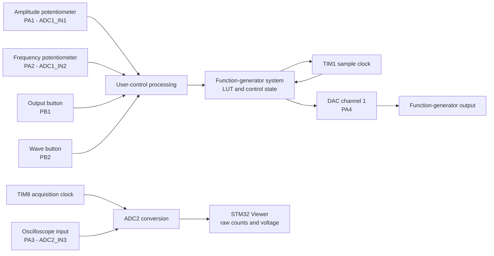
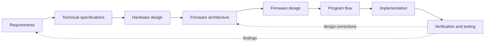
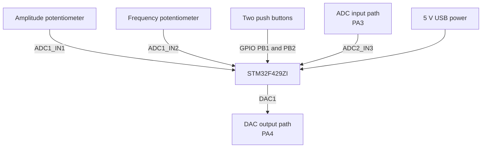
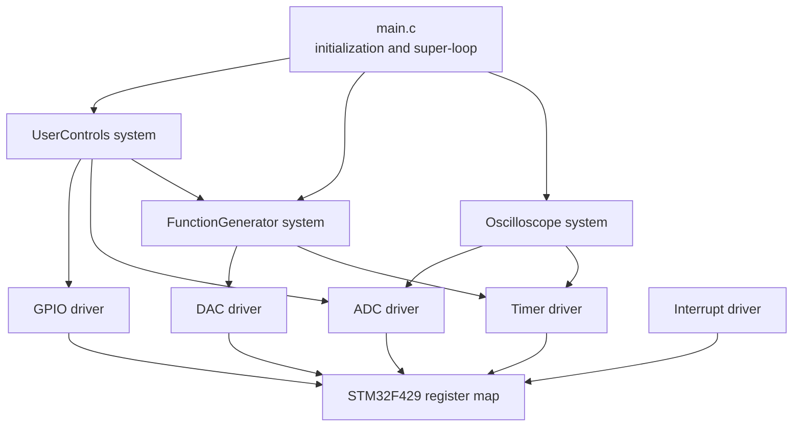
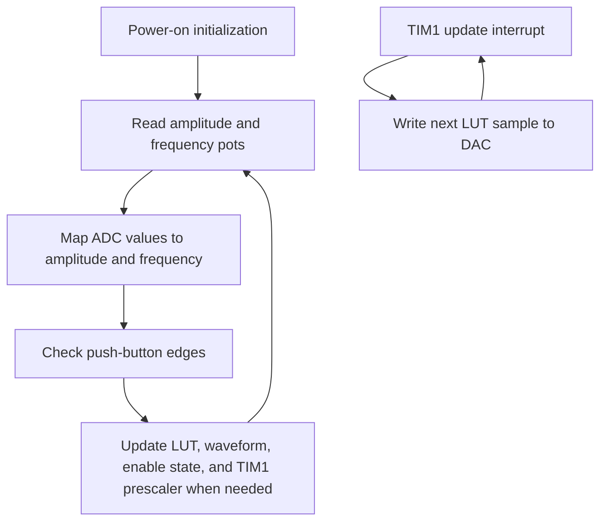
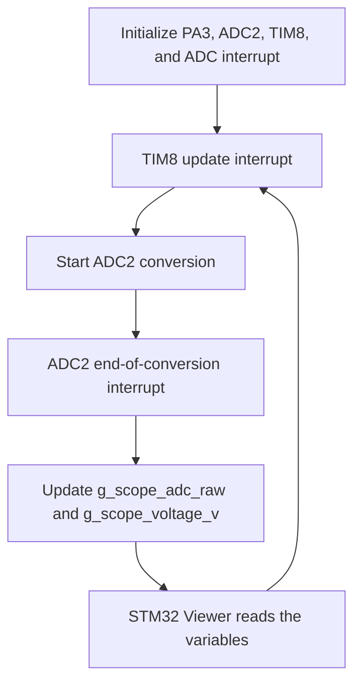

# EduScope-10

**Low-cost 2-in-1 bare-metal STM32 oscilloscope and function generator**

> Mission: make practical measurement tools affordable enough that engineering students can learn by measuring, not guessing

**Project status:** functional bare-metal prototype completed on STM32F429I-DISC1  
**Next milestone:** custom Rev-A PCB

---

## 1. Why EduScope-10 exists

EduScope-10 began with a problem I experienced while studying Electronics Engineering in Sudan: many laboratories did not have enough basic measurement instruments for every student to experiment independently

The project therefore focuses on a simple product idea:

- one oscilloscope input
- one function-generator output
- direct ownership instead of shared lab access
- a core PCB BOM target of approximately **USD 10 at 1k volume**
- a modular path toward better front ends, enclosure, local display, USB control, and higher performance

The USD 10 target applies to the future core PCB BOM at volume. It excludes probes, external connectors, USB cable, enclosure, shipping, and optional expansion modules

---

## 2. Current development status

The present milestone is a working proof of concept built on the **STM32F429I-DISC1** development board

| Area | Current status |
|---|---|
| Bare-metal register access | Implemented |
| Function generator | Implemented and bench-tested |
| Sine, square, triangle, sawtooth | Implemented |
| Variable frequency and amplitude | Implemented using two potentiometers |
| Waveform selection and output control | Implemented using two push buttons |
| Oscilloscope ADC acquisition | Implemented using ADC2 and TIM8 |
| Live signal visualization | Implemented using STM32 Viewer |
| LCD user interface | Not part of the validated prototype |
| Protected analog front end | Planned for Rev-A PCB |
| USB data/control interface | Planned |
| Formal performance verification | Planned |
| Custom PCB | Next development step |

The current prototype demonstrates that both instrument paths work at register level without CubeMX-generated peripheral code or HAL-based signal processing

---

## 3. Prototype capabilities

### Function generator

- STM32 DAC channel 1 output on **PA4**
- 128-sample lookup table
- TIM1 update interrupt used as the waveform sample clock
- supported waveforms:
  - sine
  - square
  - triangle
  - sawtooth
- amplitude controlled through a potentiometer on **PA1 / ADC1 channel 1**
- frequency controlled through a potentiometer on **PA2 / ADC1 channel 2**
- output enable/disable controlled through **PB1**
- waveform selection controlled through **PB2**
- current prototype frequency control range: approximately **0.1 Hz to 2.5 kHz**
- current prototype amplitude control: approximately **0 to 3.3 Vpp**, centered near 1.65 V

### Oscilloscope acquisition

- analog input on **PA3 / ADC2 channel 3**
- TIM8 establishes the acquisition sampling interval
- ADC2 performs one conversion per TIM8 update event
- ADC end-of-conversion interrupt updates live viewer variables
- current configured sample rate: **5 kS/s**
- live variables:
  - `g_scope_adc_raw` for raw 12-bit ADC counts
  - `g_scope_voltage_v` for the prototype-calibrated voltage value
- signal visualization currently uses **STM32 Viewer**, not the onboard LCD

> The current PA3 input is a development-board ADC input, not a protected oscilloscope front end. Keep the input inside the STM32 analog voltage range

---

## 4. System overview



---

## 5. Development workflow

The project follows a compact professional embedded-development workflow:



Each stage is treated as a prerequisite for the next, but not as a one-time frozen activity. EduScope-10 uses a tight "good-enough" loop: define enough detail to proceed, build and verify the next layer, then feed new findings back into requirements or design before technical debt accumulates

Current iteration:

```text
Requirements defined
-> prototype technical specification defined
-> development-board hardware mapped
-> bare-metal firmware architecture implemented
-> function generator validated
-> ADC2 acquisition validated
-> custom PCB architecture and schematics in progress
```

---

## 6. Technical specification - current prototype

| Item | Prototype choice |
|---|---|
| MCU board | STM32F429I-DISC1 |
| MCU | STM32F429ZI, ARM Cortex-M4F |
| Firmware language | C |
| Development environment | VS Code + PlatformIO |
| Peripheral implementation | Direct register access |
| Generated peripheral code | None |
| Current core clock assumption | 16 MHz |
| AWG output | DAC1 on PA4 |
| AWG timing | TIM1 update interrupt |
| Waveform table | 128 samples |
| Control ADC | ADC1, channels 1 and 2 |
| Oscilloscope ADC | ADC2, channel 3 |
| Oscilloscope timing | TIM8 update interrupt |
| Prototype visualization | STM32 Viewer |
| Power | Development-board USB power |

---

## 7. Hardware design view

This diagram intentionally shows only firmware-relevant hardware blocks and peripheral relationships. Passive protection, filtering, biasing, decoupling, and PCB details belong in the schematic documents



### Prototype pin map

| Function | STM32 pin | Peripheral |
|---|---|---|
| Function-generator output | PA4 | DAC1_OUT1 |
| Amplitude potentiometer | PA1 | ADC1_IN1 |
| Frequency potentiometer | PA2 | ADC1_IN2 |
| Oscilloscope input | PA3 | ADC2_IN3 |
| Output enable button | PB1 | GPIO input with pull-down |
| Waveform selection button | PB2 | GPIO input with pull-down |

---

## 8. Firmware architecture

The refactored firmware separates hardware-dependent register code from instrument behavior



### Architecture rules

- `include/interfaces` defines instrument-level module APIs
- `include/drivers` defines hardware driver contracts
- `src/systems` contains function-generator, oscilloscope, and user-control behavior
- `src/drivers/stm32f429` contains MCU-specific register access
- `main.c` contains only startup and top-level execution
- interrupt handlers delegate immediately to the responsible module
- unused LCD/framebuffer code and commented experimental blocks were removed
- register-level operation and the proven waveform/acquisition behavior were retained

The driver layer uses the direct-call/wrapper approach: STM32 register access remains inside the driver implementation instead of being spread through the system modules

---

## 9. Program flow

### Function generator



### Oscilloscope acquisition



---

## 10. Repository structure

```text
EduScope-10/
├── include/
│   ├── eduscope_config.h
│   ├── drivers/
│   │   ├── adc_driver.h
│   │   ├── dac_driver.h
│   │   ├── gpio_driver.h
│   │   ├── interrupt_driver.h
│   │   └── timer_driver.h
│   └── interfaces/
│       ├── function_generator.h
│       ├── oscilloscope.h
│       └── user_controls.h
├── src/
│   ├── drivers/
│   │   └── stm32f429/
│   │       ├── adc_driver.c
│   │       ├── dac_driver.c
│   │       ├── gpio_driver.c
│   │       ├── interrupt_driver.c
│   │       ├── stm32f429_registers.h
│   │       └── timer_driver.c
│   ├── systems/
│   │   ├── function_generator.c
│   │   ├── oscilloscope.c
│   │   └── user_controls.c
│   ├── interrupt_handlers.c
│   └── main.c
├── docs/
│   ├── requirements.md
│   └── verification-plan.md
├── platformio.ini
└── README.md
```

---

## 11. Build and run

### Requirements

- STM32F429I-DISC1
- VS Code
- PlatformIO extension
- ST-LINK connection
- STM32 Viewer for prototype ADC visualization
- signal source for oscilloscope testing
- oscilloscope or logic analyzer for function-generator validation

### Build

```bash
pio run
```

### Flash

```bash
pio run --target upload
```

### Prototype use

1. Connect the amplitude potentiometer to PA1
2. Connect the frequency potentiometer to PA2
3. Connect the two buttons to PB1 and PB2 according to the pull-down input design
4. Measure the generated waveform on PA4
5. Apply only a safe 0 to 3.3 V signal to PA3
6. Open STM32 Viewer and monitor:

```text
g_scope_adc_raw      uint16_t     range 0 to 4095
g_scope_voltage_v    float        prototype-calibrated voltage
```

The viewer is a development visualization tool. Formal sample-rate, bandwidth, ENOB, and frequency measurements must be performed from captured buffers and calibrated bench equipment

---

## 12. Safety and standards strategy

### Anchor standard

**IEC 61010-1** is the Rev-A safety design anchor because EduScope-10 is measurement equipment. It guides decisions around:

- declared measurement category and voltage limits
- SELV boundaries
- input protection
- insulation
- creepage and clearance
- single-fault behavior
- labeling and warnings
- abnormal-operation verification

### Important status statement

The current development-board prototype is **not certified measurement equipment** and must not be connected to mains, CAT II, CAT III, CAT IV, or hazardous-energy circuits

The intended Rev-A baseline is **CAT I / SELV only**. Compliance must be demonstrated through completed hardware design, risk analysis, documented tests, and the applicable conformity process. The repository does not claim certification

### Later-phase standards work

- IEC 61326-1 for EMC emissions and immunity
- RoHS supplier documentation
- WEEE and recyclability documentation

---

## 13. Rev-A requirements

Requirements are stored with stable IDs so design decisions and verification evidence remain traceable

- [Product and system requirements](docs/requirements.md)
- [Verification plan](docs/verification-plan.md)

The target requirements include:

- CAT I / SELV operation
- protected oscilloscope input
- at least 1 MS/s sustained single-channel capture
- at least 100 kHz analog bandwidth
- edge trigger with pre/post-trigger capture
- sine, square, triangle, DC, and arbitrary waveform generation
- USB CDC control and binary data transfer
- calibration storage with CRC
- eight-hour stress operation

These are **Rev-A targets**, not completed-prototype claims

---

## 14. Verification completed so far

The proof-of-concept milestone has confirmed:

- bare-metal STM32F429 peripheral initialization
- TIM1-driven DAC sample output
- generation of sine, square, triangle, and sawtooth waveforms
- real-time amplitude adjustment
- real-time frequency adjustment
- push-button waveform selection
- output enable/disable control
- TIM8-driven ADC2 acquisition
- live raw and scaled ADC values in STM32 Viewer
- simultaneous presence of function-generator and oscilloscope firmware paths in the modular codebase

Formal verification is still required for:

- sample-rate accuracy
- analog bandwidth
- trigger performance
- ENOB
- input impedance
- THD
- output amplitude accuracy under load
- calibration retention
- long-duration stress
- power consumption
- electrical safety

---

## 15. Roadmap

### Completed

- [x] Define mission and first product requirements
- [x] Select STM32F429 development platform
- [x] Implement direct register definitions
- [x] Implement DAC waveform generation
- [x] Implement four waveform types
- [x] Implement potentiometer-based amplitude and frequency control
- [x] Implement push-button control
- [x] Implement ADC2 oscilloscope acquisition
- [x] Validate live acquisition through STM32 Viewer
- [x] Refactor the prototype into driver and system modules

### Next

- [ ] Freeze Rev-A requirements and pin allocation
- [ ] Complete protected analog front-end design
- [ ] Complete function-generator output buffer and filtering
- [ ] Finalize power, SWD, controls, and connector sheets
- [ ] Complete ERC and design reviews
- [ ] Route the custom two-layer PCB
- [ ] Manufacture and assemble Rev-A
- [ ] Port the validated firmware to the custom PCB
- [ ] Add ADC timer trigger and DMA capture buffer
- [ ] Add triggering and measurement functions
- [ ] Add USB control and data transfer
- [ ] Execute the verification plan

---

## 16. Final milestone statement

A **fully functional bare-metal prototype** has been completed for both waveform generation and oscilloscope acquisition. The next development step is the **custom EduScope-10 PCB**
